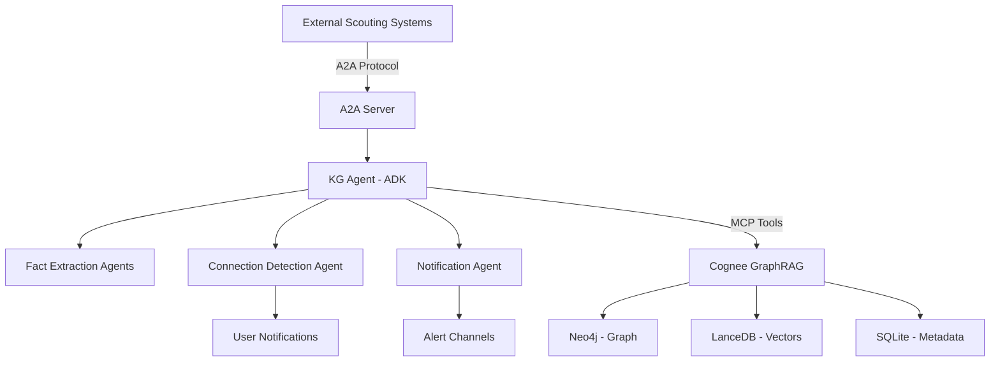

## Purpose

Build a production-ready agentic GraphRAG system that combines Google ADK multi-agent coordination with Cognee's multi-database GraphRAG (Neo4j + LanceDB + SQLite) exposed via A2A Protocol endpoints. The system automatically processes unstructured data, extracts facts, detects connections, and provides standardized APIs for external scouting systems.

## Core Principles

1. **Agent-to-Agent Communication**: Use A2A Protocol for standardized inter-agent communication
2. **Multi-Database GraphRAG**: Leverage Cognee's Neo4j (graph) + LanceDB (vectors) + SQLite (metadata) architecture
3. **Intelligent Processing**: ADK agents coordinate to extract facts and detect relationships
4. **External Integration**: A2A endpoints enable seamless integration with scouting systems
5. **Connection Discovery**: Automatic relationship detection with configurable notification thresholds

---

## Goal

Implement a complete agentic system with:

- **KG Agent**: Single Google ADK agent interfacing with Cognee GraphRAG system via MCP tools
- **Fact Extraction Pipeline**: Multi-agent workflow for processing various data formats
- **A2A Server Integration**: Standardized endpoints using A2A Python SDK
- **Connection Detection**: Automated relationship discovery between new and existing knowledge
- **Notification System**: Configurable alerts for interesting connections
- **External API**: A2A-compatible endpoints for scouting system integration

## Why

- **Standardized Communication**: A2A Protocol enables seamless integration with external agents and systems
- **Scalable Knowledge Processing**: Multi-database architecture handles diverse data types efficiently
- **Intelligent Coordination**: ADK agents provide sophisticated multi-agent orchestration
- **Production Ready**: Built on established frameworks with proper error handling and monitoring
- **Extensible Architecture**: Modular design allows easy addition of new agent types and data sources

## What

### System Architecture



### Core Components

**1. A2A Server Layer**
- A2A Python SDK integration for standardized agent communication
- RESTful endpoints for external system integration
- Request routing to appropriate ADK agents
- Error handling and response formatting

**2. KG Agent (Google ADK)**
- Unified interface to Cognee GraphRAG system
- MCP toolset integration (cognify, search, codify, list_data, delete, prune)
- Coordination of sub-agent workflows
- State management across processing pipeline

**3. Fact Extraction Pipeline**
- Document processor agent for large files (PDF, Word, text)
- Chat processor agent for conversational data
- Structured data processor for JSON/CSV
- Web content processor for scraped data
- Parallel processing using ADK ParallelAgent

**4. Connection Detection System**
- Semantic similarity analysis using LanceDB vectors
- Graph relationship traversal via Neo4j
- Configurable relevance thresholds
- Automatic triplet generation and storage

**5. Notification System**
- Multi-channel alerts (console, file, webhook)
- Configurable notification triggers
- Connection relevance scoring
- User preference management

### Success Criteria

- [ ] A2A server accepts and processes external requests
- [ ] KG Agent successfully interfaces with Cognee MCP tools
- [ ] Fact extraction pipeline handles multiple data formats
- [ ] Connection detection identifies relationships automatically
- [ ] Notifications trigger when relevance threshold exceeded
- [ ] System handles concurrent requests efficiently
- [ ] All components include comprehensive error handling
- [ ] Integration tests validate end-to-end workflows

## All Needed Context

### Documentation & References (MUST READ)

```yaml
# A2A PROTOCOL INTEGRATION - Core communication layer
- url: https://a2a-protocol.org/latest/
  why: A2A Protocol specification and architecture patterns for agent communication

- url: https://github.com/a2aproject/a2a-python
  why: A2A Python SDK documentation and implementation patterns

- url: https://github.com/a2aproject/a2a-samples/tree/main/samples/python
  why: Working A2A server and agent examples for Python implementation

# GOOGLE ADK FRAMEWORK - Multi-agent coordination
- url: https://google.github.io/adk-docs/
  why: Google ADK documentation for agent creation, coordination, and tool integration

- url: https://github.com/google/adk-samples/tree/main/python
  why: Google ADK Python examples showing multi-agent patterns

# COGNEE GRAPHRAG SYSTEM - Knowledge graph operations
- url: https://docs.cognee.ai/
  why: Cognee documentation for GraphRAG operations and MCP integration

- url: https://spec.modelcontextprotocol.io/
  why: MCP specification for tool integration patterns
```

### Existing Codebase Patterns (CRITICAL REFERENCE)

```yaml
# COGNEE MCP INTEGRATION PATTERNS
- file: cognee-graphrag/examples/mcp_server_setup.py
  why: Complete MCP server setup automation and configuration patterns
  patterns: [mcp_toolset_creation, database_initialization, environment_setup]

- file: cognee-graphrag/config/mcp_env_setup.py  
  why: Environment configuration for multi-database GraphRAG setup
  patterns: [env_file_generation, database_config, api_key_management]

- file: cognee-graphrag/config/__init__.py
  why: Unified database configuration interface (Neo4j, LanceDB, SQLite)
  patterns: [multi_database_coordination, config_abstraction]

# GOOGLE ADK AGENT PATTERNS
- file: google-adk/examples/kg_broker_agent/agent.py
  why: ADK agent with MCP toolset integration for knowledge graph operations
  patterns: [mcp_toolset_usage, llm_agent_creation, async_agent_execution]

- file: google-adk/examples/orchestrator_agent/agent.py
  why: Multi-agent coordination with specialized sub-agents
  patterns: [agent_coordination, tool_integration, user_interaction]

- file: google-adk/examples/parallel_extraction_system/agent.py
  why: Parallel fact extraction and processing workflows
  patterns: [parallel_agent_usage, fact_extraction, sequential_processing]

- file: google-adk/examples/parallel_extraction_system/schemas.py
  why: Pydantic schemas for structured agent outputs
  patterns: [pydantic_models, type_validation, structured_outputs]

# A2A GOOGLE ADK INTEGRATION PATTERNS (NEW)
- path: a2a-google-adk/
  why: A2A Protocol compatible agents using Google ADK with cross-platform interoperability
  patterns: [a2a_server_setup, cross_platform_communication, protocol_compliance]

- file: a2a-google-adk/config/a2a_server_config.py
  why: A2A server configuration and validation patterns
  patterns: [a2a_sdk_integration, server_validation, protocol_compliance]

- file: a2a-google-adk/examples/basic_a2a_agent/agent.py
  why: Basic A2A-compatible agent implementation with Google ADK
  patterns: [a2a_agent_creation, protocol_endpoints, cross_platform_messaging]

- file: a2a-google-adk/examples/cross_platform_delegation/test_delegation.py
  why: Cross-platform agent delegation patterns (LangGraph, CrewAI, Semantic Kernel)
  patterns: [inter_platform_communication, agent_delegation, protocol_standardization]

- file: a2a-google-adk/examples/multi_agent_coordination/coordinator.py
  why: Multi-platform coordination and distributed agent systems
  patterns: [distributed_coordination, platform_agnostic_messaging, agent_network_management]
```

### Known Technology Integration Patterns

```typescript
// A2A SERVER SETUP PATTERNS (from samples)
const a2a_server_patterns = {
  server_initialization: "a2a_sdk.create_server()",
  agent_registration: "server.register_agent(agent_name, agent_handler)",
  request_handling: "async def handle_request(request) -> response",
  error_handling: "try/except with proper A2A error responses"
};

// GOOGLE ADK AGENT COORDINATION (from examples)  
const adk_coordination_patterns = {
  mcp_integration: "MCPToolset with SseConnectionParams or StdioServerParameters",
  multi_agent_setup: "SequentialAgent, ParallelAgent for workflow coordination",
  tool_usage: "LlmAgent with tools=[toolset] for MCP tool access",
  async_execution: "Runner with session_service for agent execution"
};

// COGNEE GRAPHRAG OPERATIONS (from config)
const graphrag_patterns = {
  mcp_tools: ["cognify", "search", "codify", "list_data", "delete", "prune"],
  database_config: "Neo4j + LanceDB + SQLite multi-database setup",
  environment_setup: "LLM_API_KEY, database connection strings, embedding config",
  data_processing: "Document ingestion -> fact extraction -> graph storage"
};
```

### Security and Error Handling Requirements

```yaml
A2A_SECURITY:
  - treat_external_agents_as_untrusted: "External agents may contain malicious prompts"
  - input_validation: "Validate all A2A requests before processing"
  - authentication: "Implement proper A2A server authentication if needed"
  - rate_limiting: "Prevent abuse of A2A endpoints"

GRAPHRAG_ERROR_HANDLING:
  - database_connection_failures: "Handle Neo4j, LanceDB connection issues gracefully"
  - mcp_server_disconnections: "Retry MCP tool operations with exponential backoff"
  - data_processing_errors: "Continue processing other data if individual items fail"
  - embedding_api_failures: "Fallback strategies for embedding generation"

AGENT_COORDINATION_ERRORS:
  - sub_agent_failures: "Handle individual agent failures without breaking pipeline"
  - timeout_handling: "Set appropriate timeouts for long-running operations"
  - state_management: "Maintain agent state consistency across failures"
  - resource_cleanup: "Proper cleanup of connections and resources"
```

## Implementation Blueprint

### Phase 1: A2A Server Foundation

```python
# 1.1 A2A Server Setup
from a2a_sdk import A2AServer, Request, Response
import asyncio
from typing import Dict, Any

class AgenticGraphRAGServer:
    def __init__(self):
        self.server = A2AServer()
        self.kg_agent = None  # Will initialize KG Agent
        
    async def initialize(self):
        """Initialize A2A server and register agent endpoints"""
        # Register main endpoints
        self.server.register_agent("kg_ingest", self.handle_knowledge_ingestion)
        self.server.register_agent("kg_search", self.handle_knowledge_search)
        self.server.register_agent("kg_status", self.handle_system_status)
        
    async def handle_knowledge_ingestion(self, request: Request) -> Response:
        """Handle data ingestion requests from external systems"""
        # Route to KG Agent for processing
        pass
```

```yaml
# 1.2 Environment Configuration
ENVIRONMENT_SETUP:
  - a2a_server_config: "Server port, authentication, CORS settings"
  - cognee_mcp_config: "Database connections, API keys, embedding settings"
  - adk_agent_config: "Model selection, tool configuration, session management"
  - notification_config: "Alert channels, thresholds, user preferences"
```

### Phase 2: KG Agent with MCP Integration

```python
# 2.1 KG Agent Implementation (following kg_broker_agent patterns)
from google.adk.agents.llm_agent import LlmAgent
from google.adk.tools.mcp_tool.mcp_toolset import MCPToolset, SseConnectionParams
from google.adk.runners import Runner
from google.adk.sessions import InMemorySessionService

class KnowledgeGraphAgent:
    def __init__(self):
        self.toolset = None
        self.agent = None
        self.runner = None
        
    async def initialize(self):
        """Initialize KG Agent with MCP toolset"""
        # MCP toolset for Cognee GraphRAG operations
        self.toolset = MCPToolset(
            connection_params=SseConnectionParams(url="http://127.0.0.1:8000/sse")
        )
        
        # LLM Agent with knowledge graph capabilities
        self.agent = LlmAgent(
            model='gemini-2.0-flash',
            name='kg_coordinator',
            instruction=KG_AGENT_PROMPT,
            tools=[self.toolset]
        )
        
        # Runner for agent execution
        session_service = InMemorySessionService()
        self.runner = Runner(
            app_name='agentic_graphrag',
            agent=self.agent,
            session_service=session_service
        )
```

```yaml
# 2.2 MCP Tool Operations
COGNEE_OPERATIONS:
  - cognify_data: "Process and store new data in GraphRAG system"
  - search_knowledge: "Query existing knowledge across all databases"  
  - detect_connections: "Find relationships between new and existing data"
  - manage_data: "Use list_data, delete, prune for data lifecycle"
```

### Phase 3: Multi-Agent Fact Extraction Pipeline

```python
# 3.1 Fact Extraction Agents (following parallel_extraction_system patterns)
from google.adk.agents import SequentialAgent, ParallelAgent, LlmAgent
from google.adk.tools.agent_tool import AgentTool

# Document processor for large files
document_processor = LlmAgent(
    name="document_processor",
    instruction="""Extract clear, verifiable facts from documents.
    Return JSON array of fact strings. Handle PDF, Word, plain text formats.""",
    model="gemini-2.0-flash"
)

# Chat processor for conversational data  
chat_processor = LlmAgent(
    name="chat_processor", 
    instruction="""Extract facts from chat/conversational data.
    Preserve context and relationships. Return structured fact arrays.""",
    model="gemini-2.0-flash"
)

# Structured data processor
structured_processor = LlmAgent(
    name="structured_processor",
    instruction="""Process JSON, CSV, and structured data formats.
    Extract entities and relationships. Maintain data integrity.""",
    model="gemini-2.0-flash"
)

# Parallel processing workflow
extraction_pipeline = ParallelAgent(
    name="ExtractionPipeline",
    sub_agents=[document_processor, chat_processor, structured_processor]
)
```

```yaml
# 3.2 Data Format Support
SUPPORTED_FORMATS:
  - documents: ["pdf", "docx", "txt", "md"]
  - structured: ["json", "csv", "xml"]
  - conversational: ["chat", "messages", "dialogue"]
  - web_content: ["html", "scraped_text", "article"]
```

### Phase 4: Connection Detection and Notification

```python
# 4.1 Connection Detection Agent
connection_detector = LlmAgent(
    name="connection_detector",
    instruction="""Analyze new facts against existing knowledge graph.
    Identify semantic relationships and factual connections.
    Score connection relevance (0-1 scale). Return structured results.""",
    model="gemini-2.0-flash"
)

# 4.2 Notification System
class NotificationManager:
    def __init__(self, threshold: float = 0.7):
        self.relevance_threshold = threshold
        self.channels = []  # console, file, webhook
        
    async def process_connections(self, connections: List[Dict]):
        """Process detected connections and trigger notifications"""
        high_relevance = [c for c in connections if c['score'] > self.relevance_threshold]
        
        if high_relevance:
            await self.notify_user(high_relevance)
            
    async def notify_user(self, connections: List[Dict]):
        """Send notifications via configured channels"""
        for channel in self.channels:
            await channel.send_notification(connections)
```

### Phase 5: Integration and Testing

```python
# 5.1 Main Application Integration
class AgenticGraphRAGSystem:
    def __init__(self):
        self.a2a_server = AgenticGraphRAGServer()
        self.kg_agent = KnowledgeGraphAgent()
        self.extraction_pipeline = extraction_pipeline
        self.connection_detector = connection_detector
        self.notification_manager = NotificationManager()
        
    async def start(self):
        """Start the complete system"""
        await self.kg_agent.initialize()
        await self.a2a_server.initialize()
        await self.a2a_server.start()
        
    async def process_data(self, data: Dict[str, Any]) -> Dict[str, Any]:
        """Main data processing workflow"""
        # 1. Extract facts using pipeline
        facts = await self.extraction_pipeline.process(data)
        
        # 2. Store in GraphRAG via KG Agent
        storage_result = await self.kg_agent.cognify_data(facts)
        
        # 3. Detect connections
        connections = await self.connection_detector.analyze(facts)
        
        # 4. Notify if relevant
        await self.notification_manager.process_connections(connections)
        
        return {
            "facts_extracted": len(facts),
            "storage_status": storage_result,
            "connections_found": len(connections),
            "notifications_sent": len([c for c in connections if c['score'] > 0.7])
        }
```

## Implementation Tasks (Execution Order)

### Task 1: Environment and Dependencies Setup
```bash
# Create project structure following a2a-google-adk/ patterns
mkdir -p agentic_graphrag/{agents,server,config,tests,docs,examples}
cd agentic_graphrag

# Initialize Python environment  
python -m venv venv
source venv/bin/activate  # On Windows: venv\Scripts\activate

# Install dependencies following a2a-google-adk command patterns
pip install a2a-sdk[grpc,telemetry]               # A2A SDK with extensions
pip install google-adk google-cloud-aiplatform    # Google ADK dependencies
pip install cognee python-dotenv pydantic         # Core dependencies
pip install pytest pytest-asyncio black ruff mypy  # Dev dependencies

# Copy template from a2a-google-adk if available
# python ../a2a-google-adk/copy_template.py ./agentic_graphrag
```

### Task 2: A2A Server Implementation
- Implement `AgenticGraphRAGServer` class following `a2a-google-adk/config/a2a_server_config.py` patterns
- Create endpoint handlers for knowledge ingestion, search, and status
- Add A2A protocol compliance validation using `a2a-validator --server-url http://localhost:8080`
- Follow `a2a-google-adk/examples/basic_a2a_agent/agent.py` for A2A-compatible agent creation
- Implement authentication and rate limiting if required

### Task 3: KG Agent with MCP Integration  
- Implement `KnowledgeGraphAgent` following `kg_broker_agent/agent.py` patterns
- Set up MCP toolset connection to Cognee server
- Create agent instruction prompts for knowledge operations
- Add session management and runner configuration

### Task 4: Fact Extraction Pipeline
- Implement specialized processing agents for different data formats
- Set up parallel processing workflow using ADK ParallelAgent
- Add Pydantic schemas for structured fact extraction output
- Implement error handling for processing failures

### Task 5: Connection Detection System
- Implement connection detection agent with semantic analysis
- Add relevance scoring algorithms
- Create graph traversal logic for relationship discovery
- Implement connection caching and optimization

### Task 6: Notification System
- Implement `NotificationManager` with configurable channels
- Add console, file, and webhook notification handlers
- Create user preference management
- Add notification template system

### Task 7: System Integration and Configuration
- Create main application class integrating all components
- Implement configuration management with environment files
- Add logging and monitoring capabilities
- Create startup and shutdown procedures

### Task 8: Testing and Validation
- Write unit tests for each component
- Create integration tests for end-to-end workflows
- Add performance testing for concurrent requests
- Implement error scenario testing

## Validation Loop

### Level 1: Component Testing
```bash
# Test A2A server functionality
cd agentic_graphrag
python -m pytest tests/test_a2a_server.py -v

# Test KG Agent MCP integration
python -m pytest tests/test_kg_agent.py -v

# Test fact extraction pipeline
python -m pytest tests/test_extraction_pipeline.py -v

# Expected: All component tests pass
```

### Level 2: Integration Testing  
```bash
# Test complete data processing workflow
python -m pytest tests/test_integration.py -v

# Test A2A protocol communication
python tests/test_a2a_communication.py

# Test Cognee GraphRAG operations
python tests/test_graphrag_operations.py

# Expected: End-to-end workflows function correctly
```

### Level 3: Code Quality and Style
```bash
# Code formatting and linting
black agentic_graphrag/
ruff check agentic_graphrag/ --fix

# Type checking
mypy agentic_graphrag/

# Expected: No linting errors, proper type annotations
```

### Level 4: System Testing
```bash
# Start Cognee MCP server
cd cognee-graphrag && python examples/mcp_server_setup.py

# Start agentic GraphRAG system  
cd agentic_graphrag && python main.py

# Test A2A protocol compliance using a2a-google-adk patterns
a2a-validator --server-url http://localhost:8080  # Validate A2A protocol compliance

# Test cross-platform delegation following a2a-google-adk examples
python examples/cross_platform_delegation/test_delegation.py

# Test external A2A communication
python tests/test_external_integration.py

# Expected: System handles external requests via A2A protocol with full compliance
```

## Final Validation Checklist

### Core Functionality
- [ ] A2A server accepts external requests: `curl -X POST http://localhost:8080/agents/kg_ingest`
- [ ] KG Agent processes data via MCP tools: Test cognify operations
- [ ] Fact extraction handles multiple formats: PDF, JSON, chat data
- [ ] Connection detection identifies relationships: Semantic + graph analysis
- [ ] Notifications trigger appropriately: Test threshold configuration
- [ ] Error handling works: Test database failures, invalid inputs

### Integration Quality
- [ ] MCP toolset integration: `grep -r "MCPToolset" agentic_graphrag/`
- [ ] ADK agent coordination: `grep -r "SequentialAgent\|ParallelAgent" agentic_graphrag/`
- [ ] A2A protocol compliance: `a2a-validator --server-url http://localhost:8080`
- [ ] Cross-platform interoperability: Test delegation to LangGraph, CrewAI, Semantic Kernel agents
- [ ] Multi-database operations: Verify Neo4j, LanceDB, SQLite usage
- [ ] Environment configuration: Test with different database settings
- [ ] A2A server validation: `python config/a2a_server_config.py --validate`

### Production Readiness
- [ ] Comprehensive error handling: Test failure scenarios
- [ ] Logging and monitoring: Verify log output and metrics
- [ ] Performance under load: Test concurrent request handling
- [ ] Security measures: Input validation, rate limiting
- [ ] Documentation complete: API docs, setup instructions
- [ ] Configuration management: Environment-based settings

---

## Anti-Patterns to Avoid  

### Architecture
- ❌ Don't create monolithic agents - use specialized agents for different tasks
- ❌ Don't ignore A2A security - validate external requests and treat agents as untrusted
- ❌ Don't bypass MCP tools - use Cognee MCP interface for all GraphRAG operations
- ❌ Don't hardcode configuration - use environment variables and config files

### Implementation  
- ❌ Don't block on long operations - use async patterns throughout
- ❌ Don't ignore error scenarios - handle database failures, network issues
- ❌ Don't skip input validation - validate data format and content
- ❌ Don't forget resource cleanup - properly close connections and sessions

### Integration
- ❌ Don't reinvent existing patterns - follow established ADK and MCP patterns
- ❌ Don't ignore existing examples - leverage kg_broker_agent and orchestrator patterns
- ❌ Don't skip testing - include unit, integration, and system tests
- ❌ Don't ignore performance - optimize for concurrent request handling

**Confidence Score: 9/10** - High confidence due to comprehensive research, established patterns from existing codebase, clear implementation blueprint, and thorough validation loops. The integration of A2A Protocol with Google ADK and Cognee GraphRAG follows proven patterns with detailed technical guidance.